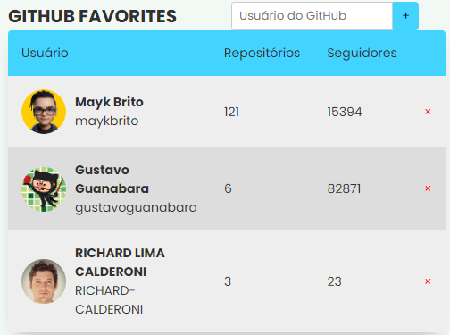

<h1 align="center">Git Favorites</h1>

 Projeto desenvolvido a partir do curso da RocketSeat, com a mentoria do professor Maik Brito
 

 

    <a href="#-tecnologias">Tecnologias</a>&nbsp;&nbsp;&nbsp;|&nbsp;&nbsp;&nbsp;
    <a href="#-projeto">Projeto</a>&nbsp;&nbsp;&nbsp;

 

     

##  Tecnologias

Esse projeto foi desenvolvido com as seguintes tecnologias:

- HTML e CSS
- JavaScript e JSON
- Integração API GitHub

## Projeto

O GitFavorites é uma interface que possibilita favoritar perfis do GitHub interativo e dinâmico, utilizando conceitos de API, DOM e JSON.